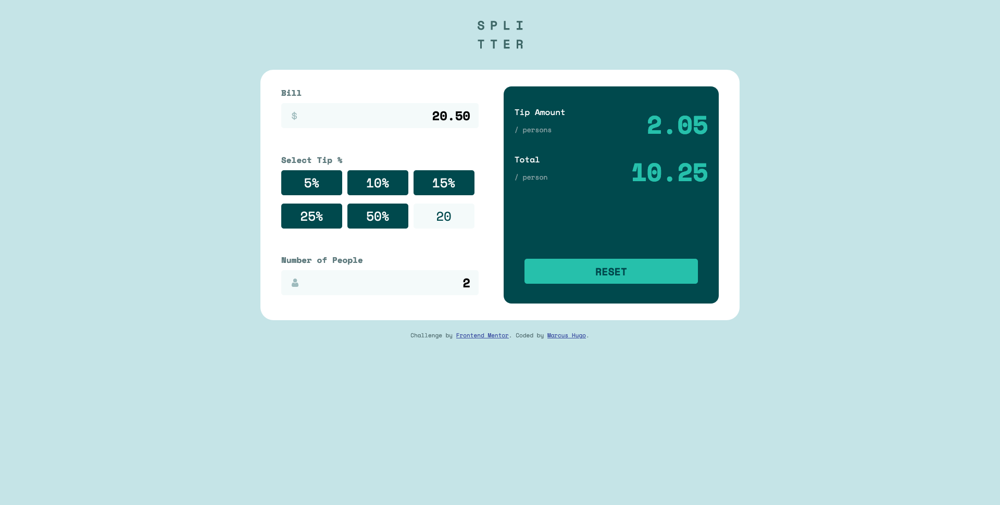

# Frontend Mentor - Tip calculator app solution

This is a solution to the [Tip calculator app challenge on Frontend Mentor](https://www.frontendmentor.io/challenges/tip-calculator-app-ugJNGbJUX). Frontend Mentor challenges help you improve your coding skills by building realistic projects.

## Table of contents

- [Overview](#overview)
  - [The challenge](#the-challenge)
  - [Screenshot](#screenshot)
  - [Links](#links)
- [My process](#my-process)
  - [Built with](#built-with)
  - [What I learned](#what-i-learned)
  - [Continued development](#continued-development)
  - [Useful resources](#useful-resources)
- [Author](#author)
- [Acknowledgments](#acknowledgments)

## Overview

### The challenge

Users should be able to:

- View the optimal layout for the app depending on their device's screen size
- See hover states for all interactive elements on the page
- Calculate the correct tip and total cost of the bill per person

### Screenshot

### Links

- Solution URL: [https://github.com/marcus-hugo/tip-calculator-app-main](https://github.com/marcus-hugo/tip-calculator-app-main)
- Live Site URL: [https://marcus-hugo.github.io/tip-calculator-app-main/](https://marcus-hugo.github.io/tip-calculator-app-main/)

## My process

### Built with

- Semantic HTML5 markup
- CSS custom properties
- Flexbox
- CSS Grid
- Mobile-first workflow
- JavaScript

### What I learned

- Using form elements with JavaScript to listen for input and click events to add functionality to the app.  Converting strings to numbers with `parseInt()` and `parseFloat()`then performing calculations. Formating decimals numbers with `Math.truc` and `toFixed()`.  

### Continued development
- Practicing JavaScript.

### Useful resources

- [https://travis.media/how-to-add-and-remove-a-class-from-list-items-with-pure-javascript/](https://travis.media/how-to-add-and-remove-a-class-from-list-items-with-pure-javascript/) - This helped with removing styling from all buttons except the one that gets clicked. Amazing and simple!

- [https://stackoverflow.com/questions/10808671/javascript-how-to-prevent-tofixed-from-rounding-off-decimal-numbers](https://stackoverflow.com/questions/10808671/javascript-how-to-prevent-tofixed-from-rounding-off-decimal-numbers) - Was only using `.toFixed()` but that kept rounding off the decimals. Based on David's answer using `Math.trunc`, first multipling by 100, then using `Math.trunc`, then dividing by 100.

- [https://gomakethings.com/listening-to-multiple-events-in-vanilla-js/](https://gomakethings.com/listening-to-multiple-events-in-vanilla-js/) - This helped with understanding how to have multiple event listeners on an element, by saving a function in a variable, then passing it as an argument when adding the event listeners.

## Author

- Website - [Marcus Hugo](https://marcus-hugo.github.io/My-Personal-Website/)
- Frontend Mentor - [@marcus-hugo](https://www.frontendmentor.io/profile/marcus-hugo)

## Acknowledgments

